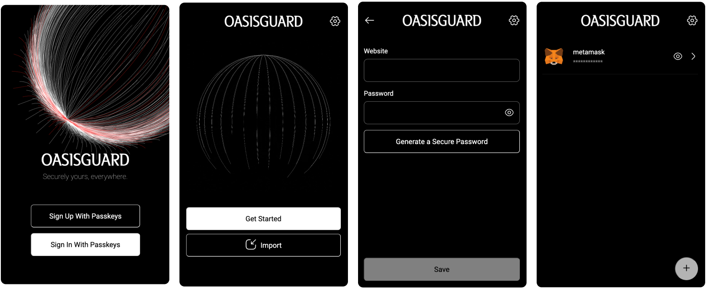

# OASISGUARD



In our daily lives, we frequently use and need to securely store numerous passwords, seed phrases, and authentication methods. As we reach a point where creating a new password and beginning to use it becomes almost a daily routine, we find ourselves in need of tools to manage these data securely. Typically, we rely on centralized password managers. However, what if these systems fail tomorrow? How secure is our data? Could we have better control over it?

These questions led us to consider blockchain as a secure storage solution. It is crucial that the data remain confidential and unrevealed, preserved within a secure contractual environment. Therefore, we opted to use Oasis's EVM-compatible Sapphire. This approach allows us to treat the contract like a 'black box,' where we can store all confidential items securely.

'If we have a black box, let's fill it with all the confidential things.'

This setup is promising, but how do we access the contract? In today's world, passkeys have become indispensable. We verified signatures from the r1 curve on Oasis, enabling users to access the contract using their passkey details and to manage passwords as they desire. Consequently, we developed a browser extension that operates with passkeys on Sapphire.

Furthermore, we wanted to add another feature commonly used in password managers: the secure transfer of passwords to another individual or group. For this purpose, we utilize Semaphore, which allows for the secure sharing of certain confidential data with friends or a team. This system anonymizes the grouping of individuals and enables private messaging through this channel. Once whitelisted by the main account, these individuals also gain access to the passwords. For instance,

## Our Deployed Contract Addresses

```
WebAuthn.sol: 0x21c12A8A12240417ECcFCe47645152EEbaaB8035
P256.sol: 0x5cAaA62aD13Ed1D8bD595E7aafeE2fC43735A7Bc
P256Verifier.sol: 0x70B46Dc19E7372e67c50E9076F2BE8291FDFB416
Verifier.sol: 0x968989eDFAB00952B5F38130Fe6178f82d54590e
ConstantVerifier.sol: 0x70198180C230169b82d3822eA264D9d06C723C61
AccountFactory.sol: 0xFe49e0f2eAab84558047Bdd7AF738c1a22F9C83b
GaslessProxy.sol: 0x6b8DCFe8EF413CAa36d71d9D6E5b13cfF4fe8780
SemaphoreVerifier.sol: 0xF1cfAB193bbA41541601da794d0e850b0A09b92D
Semaphore.sol: 0x9245483dB42fFa2087b0577bF247a0cbaaef2E84
```

## Tech Stack

| Tech                                    | Field               |
| --------------------------------------- | ------------------- |
| [Oasis](https://oasisprotocol.org/)     | Layer 1             |
| [Plasmo](https://plasmo.com/)           | Extension Framework |
| [Semaphore](https://semaphore.pse.dev/) | ZK Protocol         |
| [Solidity](https://soliditylang.org/)   | Smart Contracts     |

## Team

| Team Member                               | Field             |
| ----------------------------------------- | ----------------- |
| [Utku Ömer Kılıç](https://x.com/utmrklc)  | Software Enginner |
| [Farhad Asgarov](https://x.com/asgarovf)  | Software Enginner |
| [Eylül Şahin](https://x.com/eylllsh)      | Designer          |
| [Selim Çetiner](https://x.com/selim_jpeg) | Researcher        |
